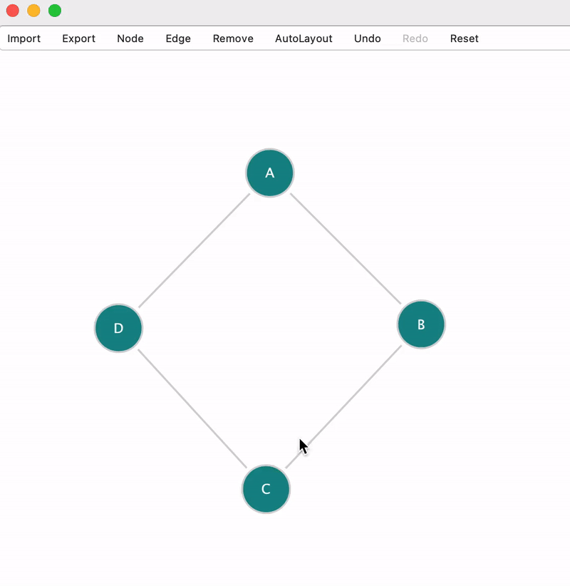

*********
Tutorials
*********

Introduction
############

Alcuin is both the viewer and editor of graphical networks with nodes, edges, and arrowheads. The network can be either created on a blank canvas or imported and edited there. The user interface of the Alcuin consists of a Toolbar and a GraphicsView with a GraphicsScene. Additionaly, a pop-up FeatureMenu exists for each network element shown on the GraphicsScene.

Items
#####

Toolbar
=======

The toolbar of the user interface is at the top of the Alcuin window. All the actions required to view or edit the network are incoporated into the toolbar. In its simplest form and when no plugin is loaded, the toolbar contain the following actions:

    * The Node action to choose the default node style,
    * The Edge action to add the default edge style,
    * The Remove action to remove nodes or edges from the scene,
    * The Undo and Redo actions,
    * The Reset action to remove all the elements from the scene.

.. figure:: images/toolbar-no-plugin.png
    :width: 700
    :alt: Toolbar with no plugin
    :align: center

    Screenshot of the toolbar with no plugin
    
By loading plugins into Alcuin, it is possible to add actions associated with those plugins into the toolbar. Currently, the following actions related to the plugins are added:

    * The Import action to load an existing network,
    * The Export action to save the network data or figure into a file,
    * The actions to add nodes with a variety of node styels,
    * The actions to add edges with a variety of edge styles and arrowhead styles,
    * The Autolayout action to automatically position the nodes on the scene.
    
.. figure:: images/toolbar-with-plugin.png
    :width: 700
    :alt: Toolbar with plugins
    :align: center

    Screenshot of the toolbar with plugins

GraphicsView
============

The GraphicsView of the user interface is placed under the toolbar. It contains an interactive GraphicsScene which enables the user to:

    * Display the nodes, edges, and arrowheads on the scene,
    * Add and remove nodes to/from the scene ,
    * Add and remove edges and arrowheads between the nodes to/from the scene,
    * Nest a node inside another node,
    * Modify nodes, edges, and arrowheads features,
    * Drag and move a node and its connected edges and arrowheads on the scene,
    * Zoom and pan on the scene.
    
FeatureMenu
===========

A FeatureMenu is created and popped-up for each network element once the user double-click on a network element. This menu enables the user to:

    * See the features of the network element, including its name, connected elements, and parent,
    * Add and remove a geometric shape to the graphics item displaying the network element on the scene,
    * Modify the style of the geometric shapes displaying the network element on the scene, including their dimensions, stroke color, fill color, fonts, and etc.
    
.. figure:: images/feature_menu.png
    :width: 350
    :alt: FeatureMenu
    :align: center

    Screenshot of the feature menu

Actions
#######

In the following, some simple examples of how a user can use Alcuin to view and edit their network are shown.

Add Node
========

To add a node to the scene, a user must first choose the Node action from the toolbar and select their desired node style. Once the node style is selected, the user must click on the position on the scene to which they want to add the node. To add multiple nodes with the same style, the user can consecutively click on multiple positions on the scene.

.. figure:: images/adding_nodes.gif
    :width: 500
    :alt: Adding nodes
    :align: center

    Adding nodes

Add Edge
========

To add an edge on the scene, a user must first choose the Edge action from the toolbar and select their desired edge style. Once the edge style is selected, the user must select the start node on the scene from which the edge is sourced and then select the end node on the scene to which the edge is targeted. To add multiple edges with the same style, the user can consecutively selecet the start and end nodes.

    Adding edges

Remove Element
==============

To remove an element from the scene, a user must first choose the Remove action from the toolbar. Then, they must select the element, either node or edge, they want to remove by clicking on it. To remove multiple elements, the user can consecutively selecet the elements on the scene.

    Removing elements

Unde/ Redo Actions
==================

To undo or redo an action, a user must click on the Undo or Redo action on the toolbar. By doing so, the latest action applied to the network elements will be undone or redone.

    Undo/ Redo actions

Reset the Scene
===============

To remove all the elements from the scene, a user must click on Reset action on the toolbar. By doing so all the network elements, including nodes, edges, and their arrowheads will be removed from the scene.

    Reset the scene
    
Zoom and Pan
============

To navigate the scene in detail, a user can scroll the mouse wheel down to zoom in and scroll it up to zoom out. By cliking on the scene and not releasing it, the user can move the mouse cursor and navigate different locations of the scene.

    Zoom and Pan
    
Drag and Drop
=============

Alcuin has an interactive scene which allows the user to change the position of the network elements at their will. To do so, a user can click on a node, drag it to another location, and drop it there. Accordingly, the position of the node and all its connected edges and arrowheads will be updated.

    Drag and Drop

Nest Node
=========

Alcuin allows the users to nest the nodes into other nodes. To do so, a user must follow the following steps:

    * Drag the node which is going to be nested,
    * Press the Shift key,
    * Locate the node above the nesting node,
    * Drop the node and release the Shift key.
    

    Nesting nodes
    
Element Feautres
================

Alcuin allows the users to change the features of each element of hte network at their will. To do so, a user can double-click on each network element. Once done, a feature menu pops up and give the user the access to the features of that element.

    Nesting nodes
    

AutoLayout
==========

The AutoLayout plugin can be used to automatically set the position of the network elements. The autolayout engines provided through this plugin can be used to position the network elements such that they follow certain patterns.

    AutoLayout

Import
======

The Import plugin allows the users to import an existing network to Alcuin. To do so, a user must first choose the Import action from the toolbar and select their desired import file format. A file dialog menu will be shown to the user to select the network file they want to import. Once the file is chosen, Alcuin imports its data and displays its network on the scene.

    Import an existing network

Export
======

The Export plugin allows the users to export a created network with Alcuin to a file. To do so, a user must first choose the Export action from the toolbar and select their desired export file format. Depending on the format chosen, the user may be asked to visually provide some extra information about the type of nodes or edges in the network. Once that information is provided, a file dialog menu will be shown to the user to select directroy in which they want to save the exported file. Once this directory is chosen, Alcuin exports the network data to the file and save it in that directory.

    Export network info to a file
